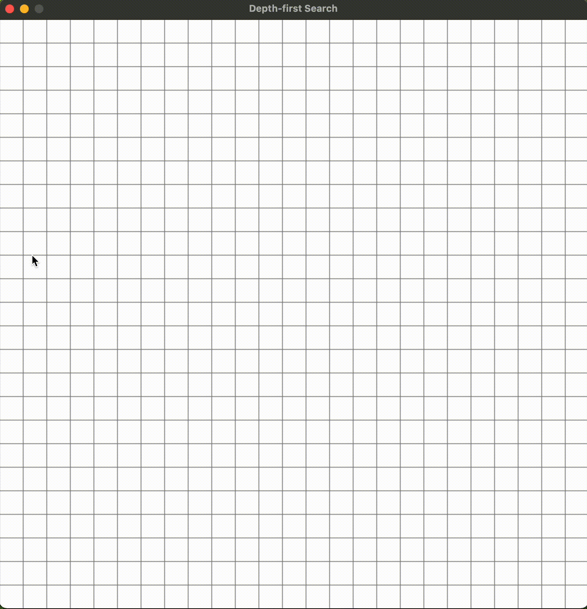

# Pathfinding Visualization

## Description

This program allows the user to select a pathfinding algorithm and place the starting and ending positions as well as obstacles. Then, the searching process is visualized and the resulting path is displayed.

## Functionality

**To Run This Program:**
- Open your terminal
- Enter into your projects directory
- Clone this repository
```
git clone "repository link"
```
- Download the required modules
```
python3 -r requirements.txt
```
- Run the program
```
python3 main.py
```

**How To Use:**
- Select an algorithm when prompted
- Place blocks using your left mouse button
    - Place the starting block (blue)
    - Place the ending block (red)
    - Place obstacles (black)
- Remove any undesired block using your right mouse button
- Run the visualization by pressing the space bar
- After the run has finished, clear the screen by pressing the 'c' or 'delete' key

## Example Output

**A\* Search Algorithm**


**Breath-first Search Algorithm**


**Depth-first Search Algorithm**



